<svg width="0" height="0" style="position: absolute;">
  <defs>
    <clipPath id="squircleClip" clipPathUnits="objectBoundingBox">
      <path d="M 0,0.5 C 0,0 0,0 0.5,0 S 1,0 1,0.5 1,1 0.5,1 0,1 0,0.5"></path>
    </clipPath>
  </defs>
</svg>

  

  

    

      

        <svg
          viewBox="0 0 24 24"
          fill="currentColor"
          class="h-8 w-8 text-white"
          xmlns="http://www.w3.org/2000/svg"
        >
          <path
            d="M12 0c-6.626 0-12 5.373-12 12 0 5.302 3.438 9.8 8.207 11.387.599.111.793-.261.793-.577v-2.234c-3.338.726-4.033-1.416-4.033-1.416-.546-1.387-1.333-1.756-1.333-1.756-1.089-.745.083-.729.083-.729 1.205.084 1.839 1.237 1.839 1.237 1.07 1.834 2.807 1.304 3.492.997.107-.775.418-1.305.762-1.604-2.665-.305-5.467-1.334-5.467-5.931 0-1.311.469-2.381 1.236-3.221-.124-.303-.535-1.524.117-3.176 0 0 1.008-.322 3.301 1.23.957-.266 1.983-.399 3.003-.404 1.02.005 2.047.138 3.006.404 2.291-1.552 3.297-1.23 3.297-1.23.653 1.653.242 2.874.118 3.176.77.84 1.235 1.911 1.235 3.221 0 4.609-2.807 5.624-5.479 5.921.43.372.823 1.102.823 2.222v3.293c0 .319.192.694.801.576 4.765-1.589 8.199-6.086 8.199-11.386 0-6.627-5.373-12-12-12z"
          ></path>
        </svg>
      

    

  
  

 

### Contacts:

 
 

   

